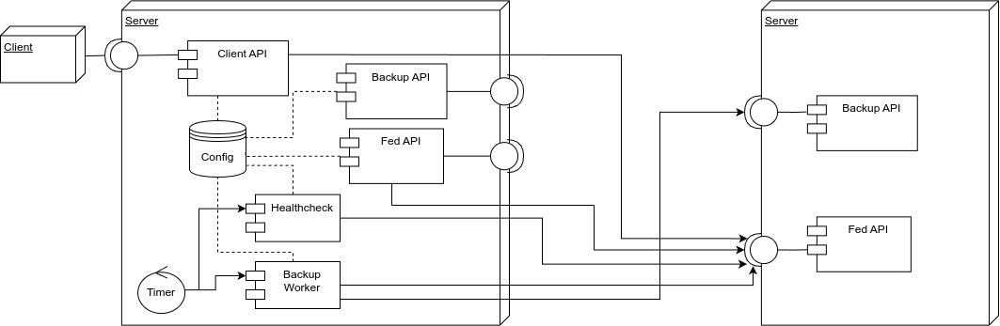

# Sicherungskammer Bayern

> Wir hüten Ihre Daten - als wären es unsere eigenen.

Föderiertes Backup System

## Idee hinter Projekt

### Problem

Wenn man selber seine Daten sichert ohne auf eine Cloud zu setzten, soll man die 3-2-1 Regel befolgen: 3 Kopien der Daten, auf 2 verschiedenen Medien und davon 1 Offsite.

Der letzte Punkt, das Offsite backup ist dabei oft ein Problem. Man muss nämlich eine zweite Location haben (am besten weit entfernt) an dem man ein Server hinstellen kann. Ein andere Lösung ist es Freunde zu haben die auch Ihre Daten selber Sichern und so sich gegenseitig helfen; da ist aber auch das Problem dass man so ein Freund haben muss und ihm auch mit den Daten vertrauen muss.

Mit unserem Projekt SKB, wollen wir diesen Punkt vereinfachen mit einer Föderierten Backup Lösung.

### Lösungsansatz

Jeder der mitmachen will, stellt 2/3 seines Speichers (warum 2/3 später) zur Verfügung für andere. Über die Föderation findet man neue Server bei denen man seine Daten hinterlegen kann. Die Daten werden dabei in einer einheitlichen Größe unterteilt. Jeder sogenannte "Block" wird verschlüsselt einem anderen Server zum Speichern gegeben. Sobald alle Daten auf jeweils auf 2 verschiedenen Server sind, sind die Daten als gesichert anzusehen. Dabei handelt es sich um ein geben und nehmen, für jedes Byte dass wir bei jemanden Speichern, darf dieser die selbe Anzahl bei uns speichern, deshalb muss man auch 2/3 des Speichers für andere zur Verfügung stellen.

## Architektur

## Probleme

### Korrektes mTLS

In Quarkus ist es nicht ohne weiteres Möglich richtiges mTLS zu benutzen. Mal kann also nicht einfach die Trustchain von einem TLS Zertifikat prüfen sondern muss jedes Zertifikat im voraus speichern. Dies ist natürlich für unsere Zwecke nicht machbar.

Ein Lösung wurde nicht gefunden, aktuell vertraut Quarkus einfach jedes TLS Zertifikat.

## Dokumentation

- [Block Verifikation](docs/project/Block-Verifikation.md)
- **Inbetriebnahme**
  - [Admin](docs/how-to/Admin.md)
  - [Endnutzer](docs/how-to/Nutzer.md)
- **Für Entwickler**
  - [API Definition](docs/developer/REST-API-Definition.md)
  - [Block Struktur](docs/developer/Block-Struktur.md)
- [Client README](SKB-CLI/README.md)
- [Server README](SKB-Server/README.md)

## CI

Das Projekt ist ein Mirror von einem Gitlab Projekt, deswegen ist die CI für Gitlab ausgelegt und läuft nicht auch Github.

## Roadmap

### Features

- [ ] [Server/Client] Client-API Pfad hinzufügen, um Informationen eines fremden Servers zu bekommen, ohne diesen hinzuzufügen
- [ ] [Server] Blöcke verschlüsseln
- [ ] [Server] Korrekte mTLS-Implementation
- [ ] [Server] /.well-known/skb Pfad hinzufügen

### TODOs

- [ ] [API] APIs in OpenAPI Spezifizieren
- [ ] [Client] Bash/ZSH/Powershell Autocomplete
- [ ] [Client] Möglichkeit Dateien via Wildcard hinzuzufügen
- [ ] [Client] Möglichkeit hinzufügen ganze Ordner zu synchronisieren
- [ ] [Client] Healthcheck Intervall in menschenleserlichem Format
- [ ] [Server] Bessere Föderation: Backup API durch Föderierte API zur Verfügung stellen. (Dynamisch, verschiedene Protokolle, Authentifizierungen)
- [ ] [Server] Blöcke wiederverwenden
- [ ] [Server] Handling: Block konnte bei remote Server nicht gelöscht werden
- [ ] [Server] Bessere Fehlerbehandlung
- [ ] [Server] Integration Tests
- [ ] [Server] Handling: Server ist offline
- [ ] [Server] Handling: Healthcheck für Block fehlgeschlagen
- [ ] [Server] Blöcke gleichmäßig zwischen Servern verteilen
- [ ] [Server] Server deklariert maintenance Fenster

### Bugs

- [ ] [Server] Gesicherte Dateigröße berechnen
- [ ] [Server] Neue Blöcke, wenn aktualisierte Datei eine andere Größe hat
- [ ] [Server] Verfügbare Hashmethoden überprüfen
- [ ] [Server] Blöcke wenn Server nicht gleiche Blockgröße haben
